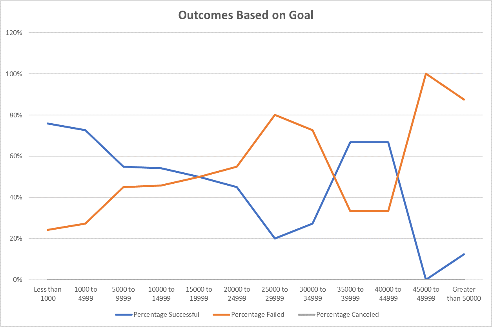

# Kickstarting with Excel

## Overview of Project
In this project,  we were tasked with the duty of helping Louise, an “up & coming” playwright, have a successful crowdfunding campaign to help fund her play “Fever”.  We looked at data that included over 4000 Kickstarter campaigns.  Next, we organized and sorted the data so that we were only looking at the category of  “theater” and later the subcategory of “plays”.  
### Purpose
We analyzed the data with the goal to help Louise determine the best month to launch her campaign and the monetary amount she should have as her goal. 
## Analysis and Challenges

### Analysis of Outcomes Based on Launch Date
For this analysis, we looked at the category “theater” to see which months the most successful campaigns were launched.   We were able to organize this data by making a pivot table that was (1) filtered by parent category and years, (2) columns that were the outcomes of successful, failed, and canceled, (3) rows that were months with which the campaign was created, and (4) values that were the sum of each type of outcome by month.  Next, I made a line chart from that data to show the overall trends for outcomes based on launch date (by month). 

### Analysis of Outcomes Based on Goals
For this analysis, we only looked at the subcategory “plays”.   The hope was to find a correlation between successful, failed, and canceled campaigns and the monetary goal in different increments varying from “Less than $1000” to “Greater than $50,000”.  I was able to make this chart by using “COUNTIFS” statements from the original Kickstarter data.  For instance, if I wanted to know how many campaigns were successful that had a goal between $10000 and $14999, I had to check 4 different parameters using the “COUNTIFS” statements – (1) “successful”, (2) >=10000, (3) <15000, and (4) “plays”.  I then calculated the percentage of successful, failed, and canceled campaigns.  From there I created a line chart showing the percentages of successful, failed, and canceled campaigns by increments ranging from  “Less than $1000” to “Greater than $50,000”.  

### Challenges and Difficulties Encountered
One of the challenges I encountered was remembering what steps I had already completed in the online lessons of module 1.  I found I have to go back and review every step I had already completed to make sure I truly remembered the processes I had already taken.  I felt this was also very helpful to truly comprehend the method of analysis.   Another challenge I encountered was using the COUNTIFS  in deliverable #2.  I ended up using some extra cells for all the incremental ranges that changed in each line so that I didn’t have to change each line of code individually.  I also did this for “successful”, “failed”, and “canceled”. 
## Results

- What are two conclusions you can draw about the Outcomes based on Launch Date?

(1) I can conclude that the best month to launch a campaign would be May with 111 out of 166 campaigns being successful (67%), followed by June with 100 out of 153 campaigns being successful (65%).

(2) I can also conclude that the worst month to start a campaign is December with 35 out of 75 campaigns failing (47%), followed by October with 50 out of 115 campaigns failing (43%). 

- What can you conclude about the Outcomes based on Goals?

I can conclude that the most successful plays had Kickstarter campaigns that were “Less than $1000” at 76% successful and  “$1000 to $4999” at 73% successful.  Louise’s goal was over $10000, so she is fortunate that her campaign was successful since only 54% were successful in that range.

- What are some limitations of this dataset?

Some limitations of the dataset are that (1) we don’t know the audience that was targeted in these campaigns and (2) we don’t know what other outside factors could have contributed to the failure or success of these campaigns.

- What are some other possible tables and/or graphs that we could create?

(1) In “Theater Outcomes by Launch Date”, I added 2 columns to show the percentage that was successful and failed.  I felt this was important because it made it more clear which months were the best options.  I also used conditional formatting to highlight the top 2 in each column. 

(2) In “Outcomes Based on Goals”, I added a table that included more broad ranges, by increments of $10000.  This showed that “Less than $10000” was the most successful with 70% success rate, followed by “$10,000 to $19,999” at a 53% success rate. 

